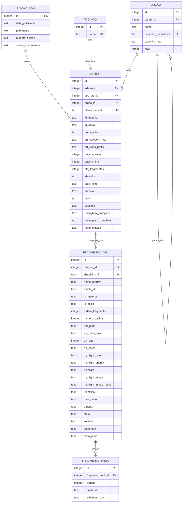

# Base relacional de publicacoes do DOU

## Objetivo

Esta nota registra a analise inicial dos XMLs coletados e propoe uma base relacional deduplicada para os atos/publicacoes da Secao 1 do Diario Oficial da Uniao.

A base proposta aqui deve representar apenas os dados do DOU: edicoes, materias, fragmentos XML, orgaos, tipos de ato e textos processaveis. A etapa de classificacao por LLM deve ser implementada depois, de forma independente, consumindo esta base como insumo e produzindo seus proprios artefatos.

## Diagnostico da duplicidade em janeiro de 2026

A sobreposicao esperada entre o pacote mensal `S01012026` do Portal de Dados Abertos e os arquivos diarios do INLABS foi confirmada.

| Medida | Total |
| --- | ---: |
| XMLs no pacote `data/extracted/dados_abertos/2026/01/S01012026` | 6.385 |
| XMLs em `data/extracted/inlabs/2026/01` | 3.701 |
| XMLs do INLABS tambem presentes no pacote mensal por nome de arquivo | 3.701 |
| XMLs presentes apenas no INLABS | 0 |
| Duplicatas com mesmo SHA-256 de conteudo | 3.701 |
| Duplicatas com mesmo `idMateria` e mesmo `article/@id` | 3.701 |

Por `pubName`, a intersecao de janeiro tem:

| `pubName` | Duplicatas |
| --- | ---: |
| `DO1` | 3.686 |
| `DO1E` | 15 |

Por data de publicacao:

| Data | Duplicatas |
| --- | ---: |
| 2026-01-14 | 229 |
| 2026-01-16 | 287 |
| 2026-01-19 | 305 |
| 2026-01-20 | 303 |
| 2026-01-21 | 344 |
| 2026-01-22 | 220 |
| 2026-01-23 | 247 |
| 2026-01-26 | 370 |
| 2026-01-27 | 349 |
| 2026-01-28 | 348 |
| 2026-01-29 | 345 |
| 2026-01-30 | 354 |

No conjunto fisico completo ha 132.027 XMLs extraidos. A deduplicacao exata por SHA-256 remove 3.701 arquivos duplicados e deixa 128.326 fragmentos XML unicos.

Decisao de modelagem: a base final nao precisa registrar que uma duplicata veio de duas fontes diferentes. O pipeline deve apenas calcular o hash de cada XML e inserir uma unica vez cada fragmento unico. Os arquivos brutos e manifestos de coleta continuam preservados fora da base, para auditoria de coleta e reprocessamento.

## Metadados disponiveis nos XMLs

Todos os 128.326 fragmentos XML unicos foram parseados sem erro. A raiz segue o padrao:

```xml
<xml>
  <article ...atributos...>
    <body>
      <Identifica>...</Identifica>
      <Data>...</Data>
      <Ementa>...</Ementa>
      <Titulo>...</Titulo>
      <SubTitulo>...</SubTitulo>
      <Texto>...</Texto>
    </body>
    <Midias>...</Midias>
  </article>
</xml>
```

Atributos encontrados em `article`:

| Campo | Observacao |
| --- | --- |
| `id` | Identificador do fragmento/artigo no XML. Nao e globalmente unico sozinho. |
| `idMateria` | Identificador da materia. Repete em fragmentos de materias longas. |
| `idOficio` | Identificador de oficio/remessa. Tambem pode agrupar muitos fragmentos. |
| `name` | Nome interno do arquivo/materia no sistema de origem. |
| `pubName` | Publicacao/edicao: principalmente `DO1` e `DO1E`; tambem ha poucos `DO1A` e 1 `DO3E`. |
| `pubDate` | Data de publicacao no formato `DD/MM/YYYY`. |
| `editionNumber` | Numero da edicao, incluindo sufixos como `69-A` ou `249-D`. |
| `numberPage` | Pagina indicada no DOU/PDF. |
| `pdfPage` | URL de visualizacao da pagina no portal de pesquisa. |
| `artType` | Tipo do ato, como `Portaria`, `Resolucao`, `Despacho`, `Instrucao Normativa`. |
| `artCategory` | Caminho hierarquico do orgao/editor, separado por `/`. |
| `artClass` | Codigo hierarquico com 12 componentes separados por `:`. |
| `artSize` | Tamanho editorial informado no XML. |
| `artNotes` | Campo livre; vazio na maior parte dos casos, mas contem marcas como `ok`, `PARTE 1`, etc. |
| `highlightType`, `highlightPriority`, `highlight` | Campos de destaque; quase sempre vazios. |
| `highlightimage`, `highlightimagename` | Campos de imagem de destaque; quase sempre vazios. |

Campos de texto em `body`:

| Campo | Fragmentos nao vazios |
| --- | ---: |
| `Texto` | 128.326 |
| `Identifica` | 109.869 |
| `Ementa` | 31.176 |
| `Data` | 1.064 |
| `SubTitulo` | 538 |
| `Titulo` | 35 |

O campo `Texto` contem HTML dentro de CDATA, com paragrafos, tabelas, enfases, imagens e notas. Ele deve ser preservado em HTML e tambem convertido para texto plano normalizado. Tamanhos observados em `Texto` HTML por fragmento:

| Medida | Caracteres |
| --- | ---: |
| Minimo | 5 |
| Mediana | 2.014 |
| P90 | 27.156 |
| P99 | 90.458 |
| Maximo | 1.380.086 |

Tags HTML mais frequentes: `p`, `td`, `tr`, `table`, `strong`, `em`, `img`, `sup`, `u`, `sub`. Isso indica que a conversao para texto plano precisa tratar tabelas de forma razoavel, sem descartar seu conteudo.

`Midias` esta vazio em 124.929 fragmentos unicos e nao vazio em 3.397. Na pratica, os elementos `Midia` frequentemente estao vazios ou contem creditos/legendas. Devem ser preservados em tabela propria, mas nao sao centrais para a estrutura analitica.

## Materias logicas e fragmentos

`idMateria` sozinho nao e chave de publicacao: ele se repete em materias longas que foram repartidas em varios XMLs/paginas. Tambem ha 9 casos em que `article/@id` se repete em publicacoes diferentes, sobretudo em `DO1A` de datas diferentes.

Agrupando fragmentos unicos pela chave:

```text
pubDate + pubName + editionNumber + idMateria + idOficio + name
```

obtemos 120.537 materias logicas. Dessas, 119.180 possuem um unico fragmento e 1.357 possuem dois ou mais fragmentos. O maior caso observado tem 230 fragmentos.

Essa chave composta nao apresentou grupos com mais de um `artType` ou mais de um `artCategory` na coleta atual, o que a torna uma boa chave inicial para montar a materia logica.

A montagem do texto completo deve ordenar os fragmentos da materia por:

1. ultimo componente numerico de `artClass`, quando ele representar sequencia do fragmento;
2. sufixo numerico do nome do arquivo, como `-1`, `-2`, `-10`;
3. `numberPage`;
4. `article/@id`, como criterio final estavel.

O texto completo da materia deve concatenar os `Texto` dos fragmentos nessa ordem. Para preservar informacao e permitir auditoria posterior, a base deve manter tambem os textos de cada fragmento.

## Solucao tecnologica adotada

Para a fase atual, a solucao adotada e SQLite, gerando uma base local em:

```text
data/database/dou.sqlite
```

Motivos:

- e um unico arquivo, facil de compartilhar e abrir em Python, R, DBeaver, Datasette e ferramentas similares;
- nao exige servidor local nem infraestrutura adicional;
- e suportado diretamente pela biblioteca padrao do Python via `sqlite3`;
- tem formato de arquivo estavel e portavel entre plataformas;
- e suficiente para o volume atual: cerca de 120 mil materias logicas e 128 mil fragmentos unicos.

Cuidados:

- SQLite nao e ideal para muitas escritas concorrentes; a construcao da base deve ser um processo batch;
- consultas analiticas muito amplas sobre campos textuais grandes podem ser mais lentas que em DuckDB;
- a base nao deve ser versionada dentro do Git, porque o arquivo gerado tende a ser grande e binario;
- e importante ativar `PRAGMA foreign_keys = ON` no codigo de construcao e criar indices depois da carga em massa;
- se houver busca textual intensiva, podemos criar uma tabela FTS5 separada ou gerar um indice textual em uma etapa posterior.

Alternativas:

- DuckDB continua sendo uma boa opcao para analise colunar e exportacao para Parquet, mas e menos universal entre pesquisadores nao tecnicos.
- PostgreSQL seria excessivo agora, salvo se a pesquisa passar a exigir acesso multiusuario em servidor.
- Parquet e excelente para distribuicao analitica e interoperabilidade, mas nao substitui sozinho uma base relacional navegavel com chaves, constraints e textos completos.

A base canonica do projeto deve ser construida em SQLite. Se necessario, snapshots auxiliares em CSV/Parquet podem ser exportados para usuarios que preferirem outros fluxos.

## Implementacao atual

A construcao da base foi implementada com biblioteca padrao do Python, sem novas dependencias obrigatorias:

| Arquivo | Funcao |
| --- | --- |
| `src/dou_classifier/parse/dou_xml.py` | Parser dos XMLs, normalizacao de metadados e conversao de HTML para texto plano. |
| `src/dou_classifier/parse/schema.sql` | Schema SQLite versionado, com tabelas, indices e views. |
| `src/dou_classifier/parse/build_database.py` | CLI e rotina de construcao da base. |
| `tests/parse/test_build_database.py` | Testes de deduplicacao, montagem de materias multi-fragmento e IDs repetidos. |

CLI disponivel:

```bash
.venv/bin/dou-build-db \
  --input-dir data/extracted \
  --database-path data/database/dou.sqlite \
  --force \
  --progress-interval 5000
```

Resultado da primeira geracao local:

| Medida | Valor |
| --- | ---: |
| Base gerada | `data/database/dou.sqlite` |
| Tamanho local | 4,1 GB |
| `PRAGMA integrity_check` | `ok` |
| Timestamp de geracao | `2026-05-18T00:45:51+00:00` |
| XMLs lidos | 132.027 |
| Duplicatas descartadas | 3.701 |
| Fragmentos XML unicos | 128.326 |
| Materias logicas | 120.537 |
| Materias com multiplos fragmentos | 1.357 |
| Edicoes | 615 |
| Orgaos na arvore normalizada | 2.434 |
| Tipos de ato | 64 |
| Midias nao vazias preservadas | 269 |

Views iniciais criadas no schema:

- `vw_materias`;
- `vw_materias_por_orgao`;
- `vw_materias_por_tipo_ato`;
- `vw_fragmentos_longos`;
- `vw_estatisticas_base`.

## DER adotado



## Estrutura das tabelas principais

### `edicao_dou`

Agrupa materias por data e publicacao (`DO1`, `DO1E`, `DO1A`, etc.).

Constraints recomendadas:

```sql
UNIQUE(data_publicacao, pub_name, numero_edicao)
```

`secao_normalizada` pode agrupar valores equivalentes para analise, mas sem apagar o `pub_name` original.

### `tipo_ato`

Tabela pequena para normalizar `artType`. A primeira versao pode usar o texto exatamente como vem do XML, com normalizacao apenas de espacos.

### `orgao`

`artCategory` e um caminho hierarquico separado por `/`. Para preservar informacao e permitir agregacao por qualquer nivel:

- manter `art_category_raw` em `materia`;
- quebrar o caminho em uma arvore `orgao`;
- ligar a materia ao no folha;
- criar uma view achatada com `orgao_nivel_1` a `orgao_nivel_7`.

Alternativa mais simples: armazenar apenas `art_category_raw` e as colunas `orgao_nivel_1` a `orgao_nivel_7` diretamente em `materia`. A arvore normalizada e um pouco mais trabalhosa, mas reduz duplicidade e facilita agregacoes por ancestralidade.

### `materia`

Representa a publicacao logica que sera usada nas etapas posteriores.

Chave natural recomendada:

```text
sha256(pubDate | pubName | editionNumber | idMateria | idOficio | name)
```

Campos como `artType` e `artCategory` devem ser promovidos para a materia. Na coleta atual, essa chave nao agrupou fragmentos com `artType` ou `artCategory` divergentes. Mesmo assim, o parser deve validar essa invariancia e registrar erro/alerta se aparecer divergencia futura.

`texto_html_completo` preserva o HTML concatenado dos fragmentos. `texto_plain_completo` e o texto processavel para filtros, busca simples e classificadores futuros.

### `fragmento_xml`

Representa cada XML unico, depois da deduplicacao por SHA-256. A constraint principal deve ser:

```sql
UNIQUE(sha256_xml)
```

Duplicatas fisicas, como os 3.701 XMLs sobrepostos de janeiro de 2026, nao entram nesta tabela. O pipeline deve escolher uma unica copia canonica do fragmento, inserir seus metadados e ignorar os caminhos duplicados.

### `fragmento_midia`

Preserva elementos `Midia` associados aos fragmentos. Como muitos estao vazios, essa tabela pode ser preenchida apenas quando houver conteudo textual ou atributos.

## Regras de deduplicacao e montagem

1. Percorrer todos os XMLs extraidos.
2. Calcular `sha256_xml` do conteudo bruto de cada arquivo.
3. Se o hash ja foi visto, ignorar o arquivo duplicado.
4. Se o hash e novo, parsear o XML e inserir uma linha em `fragmento_xml`.
5. Agrupar fragmentos unicos em `materia` pela chave natural composta.
6. Ordenar fragmentos e montar `texto_html_completo` e `texto_plain_completo`.
7. Criar/associar `edicao_dou`, `tipo_ato` e `orgao`.
8. Ao final, gravar estatisticas de construcao em uma tabela simples de metadados da base ou em um arquivo externo de manifestos.

Uma tabela opcional `base_info` pode registrar:

```text
nome
valor
```

Exemplos: data de construcao, intervalo coberto, total de arquivos lidos, total de duplicatas descartadas, total de fragmentos unicos e versao do codigo.

## Hospedagem e reproducibilidade

O repositorio GitHub deve conter codigo, documentacao, schema SQL, scripts de construcao e checksums, mas nao a base SQLite gerada.

Motivo: GitHub bloqueia arquivos acima de 100 MiB em repositorios Git comuns e recomenda manter arquivos bem menores. Releases do GitHub aceitam arquivos maiores, com limite de 2 GiB por asset, e podem servir para snapshots intermediarios, mas nao substituem um repositorio de dados de pesquisa com DOI.

Estrategia recomendada:

1. Durante o desenvolvimento, gerar `data/database/dou.sqlite` localmente e manter esse arquivo fora do Git.
2. Para compartilhar com colaboradores, publicar um snapshot compactado como release asset do GitHub se o arquivo ficar abaixo de 2 GiB compactado; caso contrario, usar OSF, Dataverse, armazenamento institucional ou outro reposititorio de dados.
3. Para a publicacao da pesquisa e reproducibilidade, depositar a base em Zenodo ou Dataverse, junto com:
   - `dou.sqlite` compactado;
   - `schema.sql`;
   - `README_data.md`;
   - `checksums.txt`;
   - versao/tag do codigo que gerou a base;
   - opcionalmente exports Parquet/CSV das tabelas principais.

Zenodo e um bom padrao inicial para arquivamento publico porque atribui DOI, aceita ate 50 GB por registro e preserva checksums. Harvard Dataverse tambem e uma boa alternativa academica, especialmente se o grupo ja usa Dataverse, mas seus limites por arquivo podem ser mais restritivos. OSF e conveniente para colaboracao e pre-registro de materiais, mas eu trataria como espaco de trabalho/compartilhamento, nao necessariamente como a unica camada final de reproducibilidade.

Referencias uteis:

- SQLite: <https://www.sqlite.org/onefile.html>
- Usos apropriados do SQLite: <https://www.sqlite.org/whentouse.html>
- GitHub repository limits: <https://docs.github.com/en/repositories/creating-and-managing-repositories/repository-limits>
- GitHub releases: <https://docs.github.com/articles/about-releases>
- Zenodo size limits: <https://support.zenodo.org/help/en-gb/1-upload-deposit/80-what-are-the-size-limitations-of-zenodo>
- OSF storage FAQ: <https://help.osf.io/category/554-add-ons-storage-api-integration-faqs>
- Harvard Dataverse for researchers: <https://support.dataverse.harvard.edu/researchers>

## Proximos passos

1. Revisar amostras da coluna `texto_plain_completo` para validar a qualidade da conversao de HTML, especialmente em tabelas longas.
2. Criar uma view achatada de orgaos com `orgao_nivel_1` a `orgao_nivel_7`.
3. Avaliar se vale criar uma tabela FTS5 para busca textual local.
4. Gerar um snapshot compactado da base e medir o tamanho final para decidir entre GitHub Releases, OSF, Zenodo ou Dataverse.
5. Definir o pacote de reproducibilidade: `dou.sqlite` compactado, `schema.sql`, checksums, tag do codigo e README de dados.
